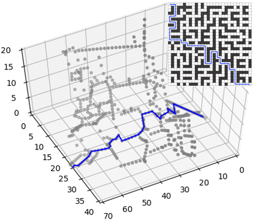



.card {
    border: 1px solid #ddd;
    border-radius: 6px;
    max-width: 350px;
    text-align: center;
    margin-top: 60px;
}
.card_img {
    width: 120px;
    height: 120px;
    overflow: hidden;
    border-radius: 100%;
    margin: -60px auto 0;
}
.card_img img {
    width: 100%;
    height: 100%;
    object-fit: cover;
}
.card_info {
    padding-bottom: 20px;
}
a {
  text-decoration: none;
  color: red;
}
a:hover{
  color: black;
}

# ARCS Lab embers
## Current Members
### PhD Students

 <!-- Here I create a New Div with class name card -->
    

        
    

    

        <h2>Yulun Zhang</h2>
    

    

        <!-- MAPF -->
        

            

                
 Foundations of Multi-Agent Path Finding (MAPF) 

                

                    <a href="https://jiaoyangli.me/research/mapf/">
                        
                        

                            

                                Developing principled algorithms to solve challenging MAPF instances
                                via a variety of AI and optimization technologies, such as
                                constraint reasoning, heuristic search, stochastic local search, and machine learning.
                            

                        

                    </a>
                

            

        

        <!-- warehouse -->
        

            

                
 Coordination of Large Robot Teams in Automated Warehouses 

                

                    <a href="https://jiaoyangli.me/research/warehouse/">
                        
                        

                            

                                Combing task planning, path planning, and execution
                                to coordinate thousands of mobile robots
                                to fulfill delivery tasks in automated warehouses.
                            

                        

                    </a>
                

            

        

        <!-- robotic arms -->
        

            

                
 Multi-Arm Assembly 

                

                    <a href="https://jiaoyangli.me/research/arm/">
                        
                        

                            

                                Developing combined task and motion planning frameworks
                                to jointly plan safe, low-cost plans
                                for a team of robots to assemble complex spatial structures.
                            

                        

                    </a>
                

            

        

        <!-- traffic -->
        

            

                
 Intelligent Traffic Management 

                

                    <a href="https://jiaoyangli.me/research/traffic/">
                        
                        

                            

                                Developing intelligent planning systems to coordinate
                                trains, airplanes, autonomous vehicle, etc. on complex road networks under uncertainty.
                            

                        

                    </a>
                

            

        

        <!-- drones -->
        

            

                
 MAPF Generalizations for Heterogeneous and Nonholonomic Robots 

                

                    <a href="https://jiaoyangli.me/research/drones/">
                        
                        <!---->
                        

                            

                                Develop principled algorithms for solving MAPF.
                                Drone Swarms Coordination
                            

                        

                    </a>
                

            

        

        <!-- others -->
        

            

                
 Other Projects 

                

                    <a href="https://jiaoyangli.me/research/others/">
                        
                        

                            
 Graph embeddings, multi-agent meeting problems, etc. 

                        

                    </a>
                

            

        

    

 