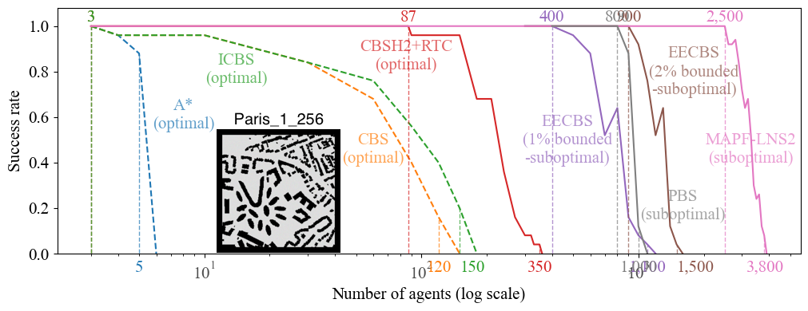
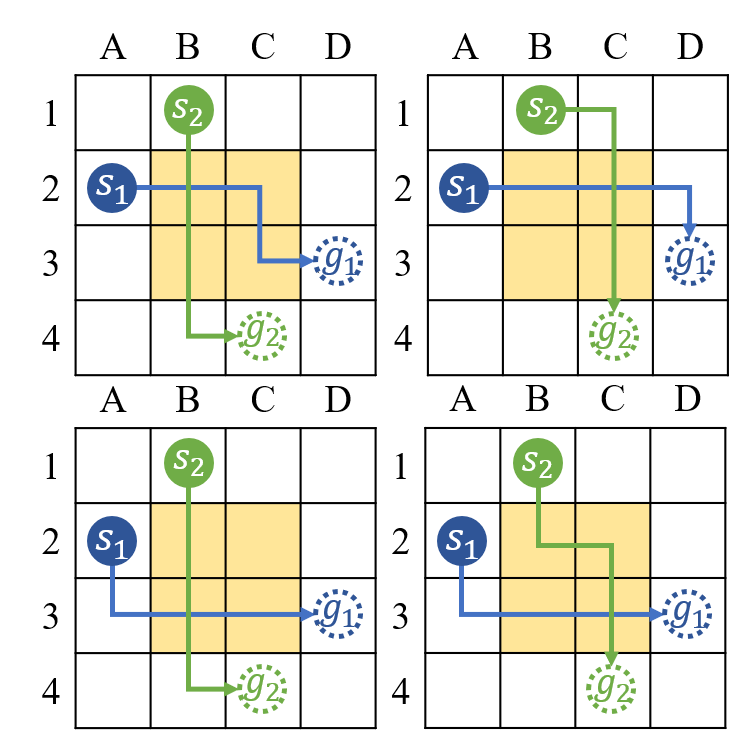
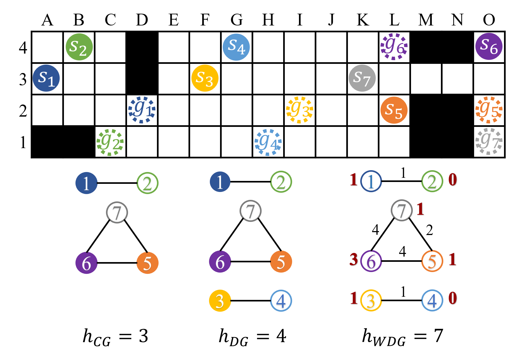



Recent advances in robotics have laid the foundation for building large-scale multi-agent systems. 
A great deal of research has focused on coordinating agents to fulfill different types of tasks. 
We focus on one fundamental task - 
to navigate teams of agents in a shared environment to their goal locations 
without colliding with obstacles or other agents.
One well-studied abstract model for this problem is known as **Multi-Agent Path Finding (MAPF)**. 
It is defined on a general graph with given start and goal vertices for agents on this graph. 
Each agent is allowed to wait at its current vertex or 
move to an adjacent vertex from one discrete timestep to the next one. 
We are asked to find a path for each agent such that no two agents are at the same vertex or 
cross the same edge at any timestep (because this would result in a collision). 
The objective is to minimize the sum of the arrival times of all agents.

We push the limits of MAPF solving by developing a variety of AI and optimization techniques to 
systematically reasoning about the **collision-resolution space** of the problem. 
Our optimal, bounded-suboptimal, and suboptimal MAPF algorithms can find solutions for 
a few hundred, a thousand, and a few thousand agents, respectively, within just a minute. 
The diagram below summarizes the empirical performance of some of our MAPF algorithms (solid lines)
in comparison to some baseline MAPF algorithms (dashed lines).
Success rate is the percentage of MAPF instances solved within a runtime limit of one minute.

    
Show the details of this empirical result.

    The experiments were conducted on AWS EC2 instances “m4.large” with a runtime of 1 minute. 
    The MAPF instances are the 25 instances in the ``random'' scenario on map ``Paris_1_256'' 
    from <a href="https://movingai.com/benchmarks/mapf/index.html">the MAPF benchmark suite</a>. 
    The details of each MAPF algorithm are as follows.
    <ul>
    <li>
        A* is a vanilla A* algorithm that searches the joint-state space of the agents.
    </li>
    <li>
        CBS is from 
        <a href="https://ojs.aaai.org/index.php/AAAI/article/view/8140">[Sharon et al AAAI'12]</a>.
        Check out the code <a href="https://github.com/Jiaoyang-Li/CBSH2-RTC">here</a>.  
    </li>
    <li>
        ICBS is CBS with the conflict prioritization technique from 
        <a href="https://www.ijcai.org/Abstract/15/110">[Boyarski et al IJCAI'15]</a>.
        Check out the code <a href="https://github.com/Jiaoyang-Li/CBSH2-RTC">here</a>.  
    </li>
    <li>
        CBSH2-RTC is ICBS with the WDG heuristic from our IJCAI'20 paper, 
        the RTC symmetry reasoning from <a href="../publications/LiAIJ21">our AIJ'21 paper</a>, and 
        the bypassing technique. 
        Check out the code <a href="https://github.com/Jiaoyang-Li/CBSH2-RTC">here</a>.  
    </li>
    <li>
        EECBS is the most advanced version of EECBS from 
        <a href="../_publications/LiAAAI21eecbs">our AAAI'21 paper</a> plus SIPPS from 
        <a href="../_publications/LiAAAI22"> our AAAI'22 paper</a>.
        Check out the code <a href="https://github.com/Jiaoyang-Li/EECBS">here</a>.  
    </li>
    <li>
        PBS is PBS from <a href="../_pages/publication.md/#MaAAAI19">our AAAI'19 paper</a> plus SIPPS from <a href="../_publications/LiAAAI22"> our AAAI'22 paper</a>.
        Check out the code <a href="https://github.com/Jiaoyang-Li/PBS">here</a>.  
    </li>
    <li>
        MAPF-LNS2 is from <a href="../_publications/LiAAAI22"> our AAAI'22 paper</a>. 
        Check out the code <a href="https://github.com/Jiaoyang-Li/CBSH2-RTC">here</a>.  
    </li>
    </ul>

<!-- My research concentrates on developing AI techniques to bridge the gap between MAPF and real-world applications. My main contributions are summarized as follows: 
- Improving the scalability of MAPF algorithms:
  - Developing **symmetry reasoning** techniques to speed up optimal and bounded-suboptimal MAPF algorithms.
  - Introducing **heuristics** to conflict-based search to speed up optimal and bounded-suboptimal MAPF algorithms.
- Applying MAPF to various multi-agent systems:
  - Applying MAPF to **automated warehousing**.
  - Applying MAPF to **traffic management**.
  - Applying MAPF to multi-robot systems with **heterogeneous and nonholonomic robots**. -->

## Symmetry Reasoning for MAPF

One of the reasons MAPF problems are so hard to solve is due to a phenomena called pairwise path symmetry, which occurs when two agents have many equivalent paths, all of which appear promising, but which are
pairwise incompatible because they result in a collision. 
The symmetry arises commonly in practice and can produce an exponential explosion in the space of possible collision resolutions, leading to unacceptable runtimes for currently state-of-the-art MAPF algorithms that employ heuristic search, such as Conflict-based Search (CBS).
To break symmetries, we propose a variety of constraint-based reasoning techniques, to detect the symmetries as they arise and to efficiently eliminate, in a single branching step, all permutations of two currently assigned but pairwise incompatible paths.     
 
Highlights: 
The addition of the symmetry-reasoning techniques proposed in [3] can reduce the number of expanded nodes and runtime of the optimal algorithm CBS by up to **4 orders of magnitude** and thus can handle up to **30 times more agents** than possible before within one minute.         

Relevant publications: 
[1] [rectangle symmetry](https://aaai.org/ojs/index.php/AAAI/article/view/4565 "AAAI 2019"), 
[2] [corridor and target symmetries](https://www.aaai.org/ojs/index.php/ICAPS/article/view/6661/6515 "ICAPS 2020"), 
[3] [generalized rectangle, target, and corridor symmetry reasoning](https://arxiv.org/abs/2103.07116 "Preprint 2021"), 
[4] [automatic symmetry reasoning by mutex propagation](https://www.aaai.org/ojs/index.php/ICAPS/article/view/6677/6531 "ICAPS 2020") (**ICAPS'20 outstanding student paper**), 
[5] [mutex propagation for SAT-based MAPF](https://jiaoyang-li.github.io/files/2020-PRIMA.pdf "PRIMA 2020"), 
[6] [symmetry reasoning for k-robust MAPF](https://jiaoyang-li.github.io/files/2021-AAAI-4.pdf "AAAI 2021"), and 
[7] [symmetry reasoning with bounded-suboptimal CBS](https://arxiv.org/abs/2010.01367 "AAAI 2021").

## Heuristics for MAPF with Conflict-Based Search

Conflict-Based Search (CBS) and its enhancements are among the strongest algorithms for MAPF. 
However, existing variants of CBS do not use any heuristics that estimate future work.
Introducing admissibles heuristics to guide the high-level search of CBS can significantly reduce the size of the CBS search tree and its runtime.
Introducing more informed but potentially inadmissible heuritics to guide the high-level search of bounded-suboptimal CBS with Explicit Estimation Search can further reduce the size of its search tree and its runtime.           

Highlights: 
The addition of the admissible heuristics proposed in [2] can reduce the number of expanded nodes and runtime of CBS by up to **a factor of 50** and thus an handle up to **3 times more agents** than possible before within one minute.
The bounded-suboptimal MAPF algorithm proposed in [3] can find solutions that are **provably at most 2% worse than optimal** with **1,000 agents** in one minute, while, on the
same map, state-of-the-art optimal algorithms can handle at most 200 agents.             

Relevant publications: 
[1] [CG heuristicy for CBS](https://aaai.org/ocs/index.php/ICAPS/ICAPS18/paper/view/17735/16965 "ICAPS 2018"), 
[2] [DG and WDG heuristics for CBS](https://www.ijcai.org/proceedings/2019/0063.pdf "IJCAI 2019"), and
[3] [inadmissible heuristic for bounded-suboptimal CBS](https://arxiv.org/abs/2010.01367 "AAAI 2021").
